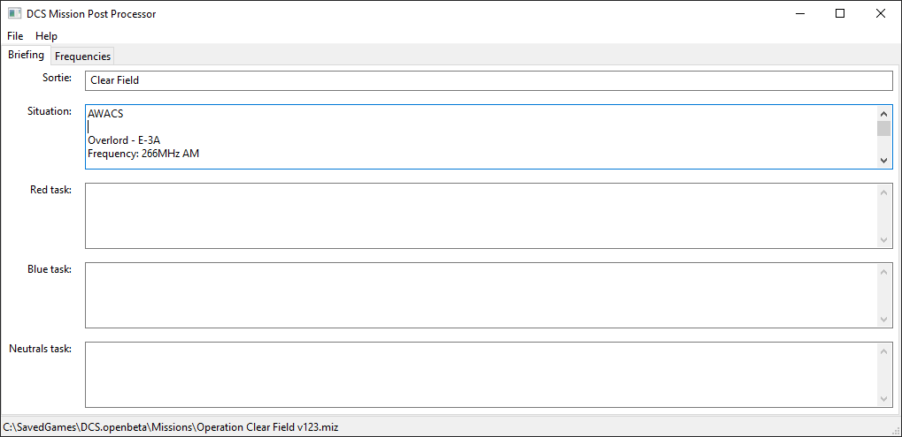
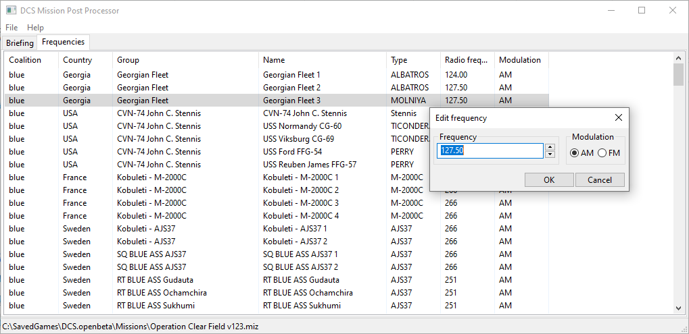

# DCS Mission Post Processing tools

Small tool set for post processing (ie. editing some features of missions already created with a mission editor) DCS missions.

## WARNING

Anything here is in **really** alpha state, please, **please** do not overwrite your actual mission files with what this tool will produce. I was testing this on several missions, mine, downloaded and it was ok, but in some cases it can just BREAK your mission file. Just edit the mission and save it as another file. Do not overwrite your miz file. You can report any bug in the issue tab.

## Features

Currently the tool can:

* edit briefing (sortie, red/blue/neutrals task)
* edit units and groups frequencies (especialy helpful for AWACS', tankers or carriers)

## Screenshots

## Features

Purpose of this tool is to ease anything involved to DCS mission editing, if you have any idea please just create an issue here.
